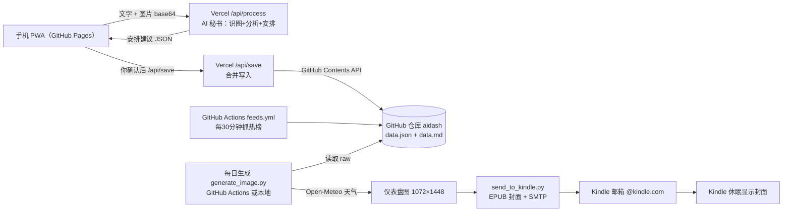

# AiDash 个人生活驾驶舱 — A 部分：整体架构说明与服务注册清单

> 版本：v1.0（2026-08-11）｜ 配套实施计划：AI 秘书模式

## 1. 这是什么

一个“手机随手记 → AI 秘书安排 → GitHub 存储 → 每日 Kindle 仪表盘”的个人生活驾驶舱。
你在手机上用文字或照片记录琐碎信息，AI（默认 DeepSeek）像秘书一样分析并给出安排建议（优先级、建议完成日期、理由），你确认后写入 GitHub 仓库；每天早上脚本自动生成一张 1072×1448 的仪表盘图，打包成 EPUB 推送到你的 Kindle，休眠时屏幕就显示这张全屏仪表盘。

## 2. 系统架构图



## 3. 数据流转

### 3.1 手机记录流（白天）

1. 手机打开 PWA（添加到主屏幕后像 APP）。
2. 输入文字，或拍照/选图，点“AI 秘书处理”。
3. 前端把图片压缩到最长边 1280px、JPEG 质量 0.8，连同文字转成 base64 发给 Vercel `/api/process`。
4. AI 返回：一句话总结 + 待办建议（优先级/截止日期/理由）+ 倒计时 + 笔记 + 购物清单 + 标准化 Markdown。
5. 你在手机上逐条确认/修改，点“保存到云端”。
6. Vercel `/api/save` 用 GitHub API 把合并后的数据提交回仓库的 `data.json` 和 `data.md`。

### 3.2 每日推送流（清晨自动化）

1. GitHub Actions `feeds.yml` 每 30 分钟抓 B站/知乎/微博/IT之家/UP主热榜，写入 `feeds.json`。
2. 每天 07:30 `daily_push.yml`（或本地任务计划程序）运行 `generate_image.py`：
   - 从 GitHub raw 读 `data.json`（待办/倒计时/布局/设置）、`data.md`（笔记）、`feeds.json`（热榜）；
   - 调 Open-Meteo 拿天气；
   - 用 PIL 画 1072×1448 白底黑字仪表盘。
3. `send_to_kindle.py` 把图片做成带封面的 EPUB 书，通过 SMTP 发到你的 `@kindle.com` 邮箱。
4. 亚马逊自动转换并推送到 Kindle；你打开这本书，休眠时屏幕显示封面仪表盘。

### 3.3 关键数据文件

| 文件 | 谁写 | 内容 |
|---|---|---|
| `data.json` | Vercel `/api/save` | 待办（优先级/截止日期/完成状态）、倒计时、笔记、购物、布局、设置 |
| `data.md` | Vercel `/api/save` | 按日期分节的标准化 Markdown 记录 |
| `feeds.json` | GitHub Actions | 各热榜标题列表 |

## 4. 需要注册/准备的服务清单

| # | 服务 | 用途 | 费用 | 需要准备 |
|---|---|---|---|---|
| 1 | GitHub | 数据仓库 + Pages + Actions | 免费 | 账号；新建仓库 aidash；开 Pages；建 fine-grained Token |
| 2 | Vercel | Serverless 后端 | 免费 | 账号（GitHub 登录）；导入仓库；配 9 个环境变量 |
| 3 | DeepSeek | AI 识图+整理（默认） | 按量，很便宜 | API Key；充值少量 |
| 4 | OpenAI | AI 备选（可选） | 按量，较贵 | API Key（需海外支付） |
| 5 | Open-Meteo | 天气 | 免费，无需注册 | 无（城市坐标） |
| 6 | SMTP 邮箱（QQ 推荐） | 发 Kindle 推送邮件 | 免费 | 开启 SMTP 授权码 |
| 7 | Kindle 国际账户 | 接收推送 | 免费 | 注册 amazon.com；确认 @kindle.com 邮箱；添加发件人白名单 |

### 4.1 GitHub 详细步骤

1. 打开 https://github.com 注册/登录。
2. 新建仓库：右上角 `+` → New repository → 名称填 `aidash` → 建议选 Public（免费版 Pages 最稳妥；注意仓库里不要放任何密钥）→ Create repository。
3. 开启 Pages：仓库 Settings → Pages → Source 选 “Deploy from a branch” → Branch `main` / `(root)` → Save。发布后网页地址为 `https://jiejinfeilu.github.io/aidash/web/`（页面文件在 web 子目录）。
4. 创建“写入用”Token（给 Vercel 用）：右上角头像 → Settings → Developer settings → Personal access tokens → **Fine-grained tokens** → Generate new token：
   - Repository access → Only select repositories → 选 `aidash`；
   - Permissions → Repository permissions → Contents 选 **Read and write**；
   - 过期时间自选（建议 90 天，到期后重新生成并更新 Vercel 环境变量）；
   - Generate token，**立即复制保存（只显示一次）**，命名为 `GITHUB_TOKEN`。
5. 开启 Actions 写权限：仓库 Settings → Actions → General → Workflow permissions → 选 **Read and write permissions** → Save（供热榜/每日推送工作流自动提交文件）。
6. 后续上传文件：仓库 Code → Add file → Upload files，把本机 `aidash` 文件夹里的内容拖上去提交（按阶段完成后再上传即可）。

### 4.2 Vercel 详细步骤

1. 打开 https://vercel.com ，用 GitHub 账号登录。
2. Add New → Project → Import `aidash` 仓库。
3. Framework Preset 选 **Other**；Build Command / Output Directory 留空（本项目纯 API，没有前端构建）。
4. 在 Environment Variables 里添加 9 个变量（见第 7 节表格）。
5. Deploy。部署完成后得到 `https://aidash-你的项目名.vercel.app`。
6. 以后每次仓库更新，Vercel 自动重新部署。

### 4.3 DeepSeek 详细步骤

1. 打开 https://platform.deepseek.com 注册登录。
2. 左侧 API Keys → 创建新的 API Key → 复制保存（只显示一次），命名为 `DEEPSEEK_API_KEY`。
3. 充值少量（如 ¥10~50）即可用很久。V4 模型已支持识图（传 base64 图片），国内直连无需代理。
4. 模型名默认 `deepseek-chat`（对应 V4 系列最新版本），由环境变量 `DEEPSEEK_MODEL` 控制。

### 4.4 OpenAI（可选备选）

- 如果 DeepSeek 不可用，可在 https://platform.openai.com 注册（需要海外支付方式），创建 Key，把 `AI_PROVIDER` 改为 `openai`、`OPENAI_API_KEY` 填上、`OPENAI_MODEL` 默认 `gpt-4o-mini`。
- 注意：OpenAI 国内访问需要代理；识图按 token 折算，实际费用高于 DeepSeek。默认不用它。

### 4.5 Open-Meteo（天气，无需注册）

- 完全免费、无需 Key。只要知道城市经纬度：温州 27.99,120.70；上海 31.23,121.47；北京 39.90,116.41。
- 在 PWA 的“设置”里改城市和坐标即可。

### 4.6 SMTP 邮箱（推荐 QQ 邮箱）

1. QQ 邮箱网页版 → 设置 → 账户 → 开启 “POP3/SMTP 服务”（或 IMAP/SMTP）→ 按提示发短信验证 → 得到 16 位**授权码**（不是登录密码）。
2. 发件邮箱就是你的 QQ 邮箱 `xxx@qq.com`，SMTP 服务器 `smtp.qq.com`，端口 465（SSL）。
3. 授权码填到本地 `scripts/config_local.py` 或 GitHub Actions Secrets（见第 7 节）。
4. 备用：163 邮箱（smtp.163.com，465）或 Outlook（smtp.office365.com，587）。

### 4.7 Kindle 国际账户（关键！）

- **`@kindle.cn` 邮箱已于 2024 年停用**，国区 Kindle 收不到邮件推送。必须用国际账户（amazon.com）的 `@kindle.com` 邮箱。
- 若 Kindle 已注册国际账户：到 amazon.com → 管理我的内容和设备 → 首选项 → 个人文档设置，确认“发送至 Kindle”邮箱（形如 `xxx@kindle.com`）。
- 若 Kindle 还是国区：Kindle 设置 → 我的账户 → 注销设备 → 用国际账户重新注册（海外支付方式可不填）。
- 在 “已批准的个人文档电子邮件列表” 里添加你的发件邮箱（如 QQ 邮箱），否则推送会被拒收。
- 2022 年 8 月起邮件推送不再接受 `.mobi`，所以本方案发 **EPUB**（亚马逊自动转换，封面保留）。

## 5. 免费额度与费用预估（每月）

| 项目 | 免费额度 | 预计用量 | 费用 |
|---|---|---|---|
| GitHub Pages | 不限 | 一个 PWA 页面 | ¥0 |
| GitHub Actions | 2000 分钟/月 | 热榜 48 次/天 + 每日推送 30 次 ≈ 500 分钟 | ¥0 |
| Vercel Hobby | 100GB 带宽/月 | 个人使用远低于限额 | ¥0 |
| DeepSeek | 无免费额度，按量 | 每天随手记 10~50 次调用，每次几百~几千 tokens | 约 ¥0.5~3/月 |
| Open-Meteo | 免费 | 每日 1~2 次 | ¥0 |
| QQ 邮箱 SMTP | 免费 | 每日 1 封 | ¥0 |

## 6. 国内可用性说明与备用方案

- **GitHub Pages**：国内一般可访问（你的 kindle-dash 已在用），偶尔慢，刷新即可。
- **Vercel**：`*.vercel.app` 国内部分地区偶发超时。对策：PWA 的 `web/config.js` 里 `API_BASE` 可配置；必要时把 `api/` 两个函数平移到 Cloudflare Workers（代码保持 Node 风格，改动很小）。
- **DeepSeek / Open-Meteo / 国内热榜**：均直连可用。
- 所有 Key 都存在 Vercel 环境变量 / Actions Secrets / 本地配置文件里，**绝不写进前端页面**。

## 7. 环境变量与敏感信息清单

### Vercel 环境变量（9 个）

| 变量 | 说明 | 示例 |
|---|---|---|
| AI_PROVIDER | AI 服务商 | `deepseek`（默认）/ `openai` |
| DEEPSEEK_API_KEY | DeepSeek Key | `sk-xxx` |
| DEEPSEEK_MODEL | DeepSeek 模型 | `deepseek-chat` |
| OPENAI_API_KEY | OpenAI Key（备选） | `sk-xxx` |
| OPENAI_MODEL | OpenAI 模型 | `gpt-4o-mini` |
| GITHUB_TOKEN | fine-grained PAT | `github_pat_xxx` |
| GITHUB_REPO | 仓库 | `你的用户名/aidash` |
| GITHUB_BRANCH | 分支 | `main` |
| APP_PIN | 手机端口令（4~6 位） | `1234` |

### GitHub Actions Secrets（daily_push.yml 用，7 个）

`SMTP_HOST`、`SMTP_PORT`、`SMTP_USER`、`SMTP_AUTH_CODE`、`SMTP_FROM`、`KINDLE_EMAIL`；`feeds.yml` 不需要额外 Secret（用仓库自带的 GITHUB_TOKEN 即可）。

### 本地配置文件（`scripts/config_local.py`，不上传仓库）

SMTP 账号/授权码、Kindle 邮箱、城市坐标、字体路径、GitHub raw 前缀等。

## 8. 数据文件结构与示例

### data.json

```json
{
  "version": 1,
  "updatedAt": "2026-08-11T09:00:00+08:00",
  "todos": [
    { "text": "把房租转给房东", "priority": "高", "dueDate": "2026-08-15", "done": false, "source": "ai", "createdAt": "2026-08-11T09:00:00+08:00" }
  ],
  "countdowns": [
    { "name": "参加婚礼", "date": "2026-10-03" }
  ],
  "notes": [
    { "text": "周末想学做红烧肉", "tags": ["生活"], "createdAt": "2026-08-11T09:00:00+08:00" }
  ],
  "shopping": [],
  "layout": {
    "order": ["header", "weather", "feeds", "countdown", "todo", "notes", "quote"],
    "heights": { "weather": 170, "feeds": 300, "countdown": 150, "todo": 240, "notes": 180, "quote": 90 }
  },
  "settings": { "city": "温州", "lat": "27.99", "lon": "120.70", "fontPath": "" }
}
```

### data.md

```markdown
# AiDash 生活记录

## 2026-08-11 周二

### 秘书安排

- [ ] （高，截止 08-15）把房租转给房东

### 倒计时

- 参加婚礼：2026-10-03

### 笔记

- 周末想学做红烧肉 #生活
```

### feeds.json（由 Actions 生成）

```json
{
  "generated": "2026-08-11T09:00:00.000Z",
  "bili": ["标题1", "标题2"],
  "ithome": ["标题1", "标题2"],
  "sspai": ["标题1"],
  "ups": [{ "name": "极客湾Geekerwan", "titles": ["标题1"] }]
}
```

## 9. 仓库目录结构（全部阶段完成后）

```text
aidash/
├── docs/
│   └── architecture.md          # 本文件（A 部分）
├── web/                         # B 部分：手机 PWA（GitHub Pages）
│   ├── index.html
│   ├── manifest.webmanifest
│   ├── sw.js
│   ├── config.js
│   └── icons/
├── api/                         # C 部分：Vercel 后端
│   ├── process.js
│   ├── save.js
│   └── _lib/
├── vercel.json
├── .env.example
├── scripts/                     # D/E 部分：Python 脚本
│   ├── generate_image.py
│   ├── send_to_kindle.py
│   ├── config_local.py
│   └── requirements.txt
├── .github/workflows/           # F 部分：定时任务
│   ├── feeds.yml
│   └── daily_push.yml
├── data.json                    # 运行时数据（由 Vercel 写入）
├── data.md                      # 运行时数据（由 Vercel 写入）
└── feeds.json                   # 运行时数据（由 Actions 写入）
```

## 10. 安全要点

1. 任何 Token 只存在于 Vercel 环境变量 / Actions Secrets / 本地未上传的配置文件。
2. `APP_PIN` 是唯一能调用你 API 的口令，手机端保存在浏览器本地，不要设成常见数字。
3. fine-grained PAT 只授权 `aidash` 一个仓库、只勾 Contents 读写，即使泄露影响也可控。
4. 公开仓库里不写任何密钥；介意数据公开可改用 Private 仓库（需自行确认 GitHub 免费版 Pages 可用性）。
